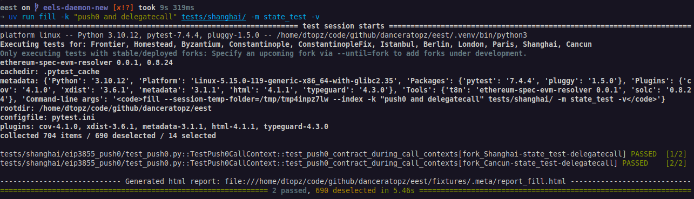

# Execution Spec Tests


[ethereum/execution-spec-tests](https://github.com/ethereum/execution-spec-tests) is both a collection of test cases and a framework implemented in Python to generate tests for Ethereum execution clients.

The framework collects and executes the test cases in order to generate _test fixtures_ (JSON) which can be consumed by any execution client to verify their implementation of [ethereum/execution-specs](https://github.com/ethereum/execution-specs). The fixtures, which define state transition and block tests, are generated by the framework using one of the `t8n` command-line tools that are provided by most execution clients, see below for an overview of the supported `t8n` tools.


The generated test fixtures can be used:

1. Directly by client teams' test frameworks, and,
2. In the integration tests executed in the [ethereum/hive](https://github.com/ethereum/hive) framework.

## Transition Tool Support

The following transition tools are supported by the framework:

| Client | "t8n" Tool | Tracing Support |
| -------| ---------- | --------------- |
| [ethereum/evmone](https://github.com/ethereum/evmone) | `evmone-t8n` | Yes |
| [ethereum/execution-specs](https://github.com/ethereum/execution-specs) | `ethereum-spec-evm` | Yes |
| [ethereum/go-ethereum](https://github.com/ethereum/go-ethereum) | [`evm t8n`](https://github.com/ethereum/go-ethereum/tree/master/cmd/evm) | Yes |
| [ethereumjs](https://github.com/ethereumjs/ethereumjs-monorepo) | [`ethereumjs-t8ntool.sh`](https://github.com/ethereumjs/ethereumjs-monorepo/tree/master/packages/vm/test/t8n) | No |
| [hyperledger/besu](https://github.com/hyperledger/besu/tree/main/ethereum/evmtool) | [`evm t8n-server`](https://github.com/hyperledger/besu/tree/main/ethereum/evmtool) | Yes |
| [status-im/nimbus-eth1](https://github.com/status-im/nimbus-eth1) | [`t8n`](https://github.com/status-im/nimbus-eth1/blob/master/tools/t8n/readme.md) | Yes |

### Upcoming EIP Development

Generally, specific `t8n` implementations and branches must be used when developing tests for upcoming EIPs.

We use named reference tags to point to the specific version of the `t8n` implementation that needs to be used fill the tests.

All current tags, their t8n implementation and branch they point to, are listed in [.github/configs/evm.yaml](.github/configs/evm.yaml).

## Getting Started

### Prerequisites

The tools provided by ethereum/execution-spec-tests use `uv` ([docs.astral.sh/uv](https://docs.astral.sh/uv/)) to manage their dependencies and virtual environment. `uv` downloads Python for your target platform if one of the required versions (Python 3.10, 3.11 or 3.12) is not available natively.

`uv` can be installed via curl (recommended; can self-update):

```console
curl -LsSf https://astral.sh/uv/install.sh | sh
```

or pip (requires Python, can't self-update):

```console
pip install uv
```

### Installation

Clone [execution-spec-tests](https://github.com/ethereum/execution-spec-tests) and install its dependencies:

```console
git clone https://github.com/ethereum/execution-spec-tests
cd execution-spec-tests
uv sync --all-extras
uv run solc-select use 0.8.24 --always-install
```

See [Installation Troubleshooting](./installation_troubleshooting.md) in the online docs if you encounter issues.

### Exploring and Filling Test Cases

By default, JSON test fixtures are generated from this repository's Python test cases using the [Ethereum Execution Layer Specification](https://github.com/ethereum/execution-specs) (EELS) reference implementation. The resulting JSON fixtures can be executed against execution clients to verify consensus. The process of generating fixtures is often referred to as "filling".

1. Explore test cases via `--collect-only` and search for test cases that combine `PUSH0` and `DELEGATECALL` in the EVM functionality introduced in the Shanghai hard fork:

    ```console
    uv run fill --collect-only -k "push0 and delegatecall" tests/shanghai/
    ```

    The `fill` command is based on [`pytest`](https://docs.pytest.org/en/stable/). The above command uses the [optional pytest arguments](https://docs.pytest.org/en/stable/how-to/usage.html):

    - `--collect-only` only collect test cases; don't execute them.
    - `-k <expression>` filter test cases by their test case ID based on the given expression.
    - `tests/shanghai` the directory containing the test cases (tells `fill` to only discover test cases in this directory; default: `tests/`).

    Expected console output:
    

2. Fill `state_test` fixtures for these test cases:

    ```console
    uv run fill -k "push0 and delegatecall" tests/shanghai/ -m state_test -v
    ```

    where:

    - `-m state_test` only fills test cases marked as a `state_test` (see all available markers via `uv run fill --markers`).
    - `-v` enables verbose output.

    Expected console output:
    

3. Verify the generated fixtures:

    a. Check the corresponding fixture file has been generated:

    ```console
    head fixtures/state_tests/shanghai/eip3855_push0/push0/push0_contract_during_call_contexts.json
    ```

    b. Open the generated HTML test using the link provided at the bottom of the console output. This is written to the output directory at:

    ```console
    ./fixtures/.meta/report_fill.html
    ```

## Usage

More information on how to obtain and consume the [released test fixtures](https://github.com/ethereum/execution-spec-tests/releases) can be found in the [documentation](https://ethereum.github.io/execution-spec-tests/main/consuming_tests/).

For further help with working with this codebase, see the [online documentation](https://ethereum.github.io/execution-spec-tests/):

1. Learn [useful command-line flags](https://ethereum.github.io/execution-spec-tests/getting_started/executing_tests_command_line/).
2. [Execute tests for features under development](https://ethereum.github.io/execution-spec-tests/getting_started/executing_tests_dev_fork/) via the `--from=FORK1` and `--until=FORK2` flags.
3. _Optional:_ [Configure VS Code](https://ethereum.github.io/execution-spec-tests/getting_started/setup_vs_code/) to auto-format Python code and [execute tests within VS Code](https://ethereum.github.io/execution-spec-tests/getting_started/executing_tests_vs_code/#executing-and-debugging-test-cases).
4. Implement a new test case, see [Writing Tests](https://ethereum.github.io/execution-spec-tests/writing_tests/).

## Coverage

The available test cases can be browsed in the [Test Case Reference doc](https://ethereum.github.io/execution-spec-tests/tests/).

## Installation Troubleshooting

If you encounter issues during the installation process, please refer to the [Installation Troubleshooting](https://ethereum.github.io/execution-spec-tests/main/getting_started/installation_troubleshooting/) page.

## Contributing

Contributions and feedback are welcome. Please see the [online documentation](https://ethereum.github.io/execution-spec-tests/writing_tests/) for this repository's coding standards and help on implementing new tests.

## License

This project is licensed under the MIT License - see the [LICENSE](LICENSE) file for details.
