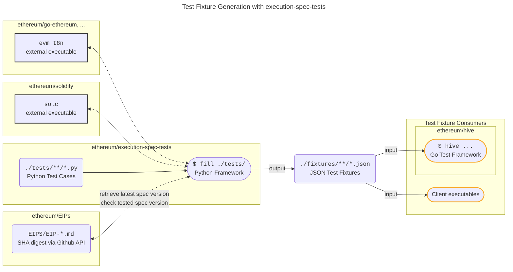

# Execution Spec Tests


[ethereum/execution-spec-tests](https://github.com/ethereum/execution-spec-tests) is both a collection of test cases and a framework implemented in Python to generate tests for Ethereum execution clients.

The framework collects and executes the test cases in order to generate _test fixtures_ (JSON) which can be consumed by any execution client to verify their implementation of [ethereum/execution-specs](https://github.com/ethereum/execution-specs). The fixtures, which define state transition and block tests, are generated by the framework using one of the `t8n` command-line tools that are provided by most execution clients, see below for an overview of the supported `t8n` tools.



The generated test fixtures can be used:

1. Directly by client teams' test frameworks, and,
2. In the integration tests executed in the [ethereum/hive](https://github.com/ethereum/hive) framework.

## Transition Tool Support

The following transition tools are supported by the framework:

| Client | "t8n" Tool | Tracing Support |
| -------| ---------- | --------------- |
| [ethereum/evmone](https://github.com/ethereum/evmone) | `evmone-t8n` | Yes |
| [ethereum/execution-specs](https://github.com/ethereum/execution-specs) | `ethereum-spec-evm` | Yes |
| [ethereum/go-ethereum](https://github.com/ethereum/go-ethereum) | [`evm t8n`](https://github.com/ethereum/go-ethereum/tree/master/cmd/evm) | Yes |
| [hyperledger/besu](https://github.com/hyperledger/besu/tree/main/ethereum/evmtool) | [`evm t8n-server`](https://github.com/hyperledger/besu/tree/main/ethereum/evmtool) | Yes |
| [status-im/nimbus-eth1](https://github.com/status-im/nimbus-eth1) | [`t8n`](https://github.com/status-im/nimbus-eth1/blob/master/tools/t8n/readme.md) | Yes |

### Upcoming EIP Development

Generally, specific `t8n` implementations and branches must be used when developing tests for upcoming EIPs.

We use named reference tags to point to the specific version of the `t8n` implementation that needs to be used fill the tests.

All current tags, their t8n implementation and branch they point to, are listed in [config-evm.yaml](config-evm.yaml).

## Getting Started

### Prerequisites

The following requires a Python 3.10, 3.11 or 3.12 installation.

### Quick Start

This guide installs stable versions of the required external (go-ethereum) `evm` and `solc` executables and will only enable generation of test fixtures for features deployed to mainnet. In order to generate fixtures for features under active development, you can follow the steps below and then follow the [additional steps in the online doc](https://ethereum.github.io/execution-spec-tests/getting_started/executing_tests_dev_fork/).

1. Ensure go-ethereum's `evm` tool and `solc` ([0.8.20](https://github.com/ethereum/solidity/releases/tag/v0.8.20), [0.8.21](https://github.com/ethereum/solidity/releases/tag/v0.8.21), [0.8.22](https://github.com/ethereum/solidity/releases/tag/v0.8.22), [0.8.23](https://github.com/ethereum/solidity/releases/tag/v0.8.23)  supported) are in your path. Either build the required versions, or alternatively:

    ```console
    sudo add-apt-repository -y ppa:ethereum/ethereum
    sudo apt-get update
    sudo apt-get install ethereum solc
    ```

    More help:

    - [geth installation doc](https://geth.ethereum.org/docs/getting-started/installing-geth#ubuntu-via-ppas).
    - [solc installation doc](https://docs.soliditylang.org/en/latest/installing-solidity.html#linux-packages).

    Help for other platforms is available in the [online doc](https://ethereum.github.io/execution-spec-tests/getting_started/quick_start/).

2. Clone the [execution-spec-tests](https://github.com/ethereum/execution-spec-tests) repo and install its dependencies (it's recommended to use a virtual environment for the installation):

   ```console
   git clone https://github.com/ethereum/execution-spec-tests
   cd execution-spec-tests
   python3 -m venv ./venv/
   source ./venv/bin/activate
   pip install -e '.[docs,lint,test]'
   ```

3. Verify the installation:
    1. Explore test cases:

       ```console
       fill --collect-only
       ```

       Expected console output:
         

    2. Execute the test cases (verbosely) in the `./tests/berlin/eip2930_access_list/test_acl.py` module:

        ```console
        fill -v tests/berlin/eip2930_access_list/test_acl.py
        ```

        Expected console output:
          
        Check:

        1. The versions of the `evm` and `solc` tools are as expected (your versions may differ from those in the highlighted box).
        2. The corresponding fixture file has been generated:

           ```console
           head fixtures/blockchain_tests/berlin/eip2930_access_list/acl/access_list.json
           ```

## Usage

More information on how to obtain and consume the [released test fixtures](https://github.com/ethereum/execution-spec-tests/releases) can be found in the [documentation](https://ethereum.github.io/execution-spec-tests/main/consuming_tests/).

For further help with working with this codebase, see the [online documentation](https://ethereum.github.io/execution-spec-tests/):

1. Learn [useful command-line flags](https://ethereum.github.io/execution-spec-tests/getting_started/executing_tests_command_line/).
2. [Execute tests for features under development](https://ethereum.github.io/execution-spec-tests/getting_started/executing_tests_dev_fork/) via the `--from=FORK1` and `--until=FORK2` flags.
3. _Optional:_ [Configure VS Code](https://ethereum.github.io/execution-spec-tests/getting_started/setup_vs_code/) to auto-format Python code and [execute tests within VS Code](https://ethereum.github.io/execution-spec-tests/getting_started/executing_tests_vs_code/#executing-and-debugging-test-cases).
4. Implement a new test case, see [Writing Tests](https://ethereum.github.io/execution-spec-tests/writing_tests/).

## Coverage

The available test cases can be browsed in the [Test Case Reference doc](https://ethereum.github.io/execution-spec-tests/tests/).

## Contributing

Contributions and feedback are welcome. Please see the [online documentation](https://ethereum.github.io/execution-spec-tests/writing_tests/) for this repository's coding standards and help on implementing new tests.

## License

This project is licensed under the MIT License - see the [LICENSE](LICENSE) file for details.
