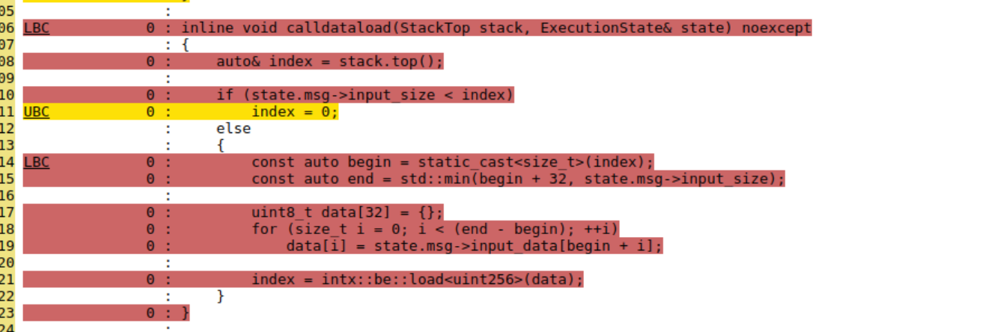

# A Guide to Porting Legacy Ethereum Tests to EEST

## Background

EEST is the successor to [ethereum/tests](https://github.com/ethereum/tests) (aka "legacy tests"), a repository that defined EVM test cases from the [Frontier](https://ethereum.org/en/history/#frontier) phase up to and including [The Merge](https://ethereum.org/en/history/#paris). These test cases are specified as YAML (and occasionally JSON) files in the [`./src/`](https://github.com/ethereum/tests/tree/develop/src) sub-directory. JSON test fixtures, which are fully-populated tests that can be executed against clients, are generated using [ethereum/retesteth](https://github.com/ethereum/retesteth). These JSON artifacts are regenerated when needed and added to the repository, typically in the [`./GeneralStateTests/`](https://github.com/ethereum/tests/tree/develop/GeneralStateTests) sub-directory.

From [Shanghai](https://ethereum.org/en/history/#shapella) onward, new test cases—especially for new features introduced in hard forks—are defined in Python within EEST. While the existing test cases remain important for client testing, porting ethereum/tests to EEST will help maintain and generate tests for newer forks. This also ensures feature parity, as client teams will only need to obtain test fixture releases from one source.

While automating the conversion of the remaining YAML (or JSON) test cases to Python is possible, manually porting individual test cases offers several benefits:

- Reducing the number of test cases by combining multiple YAML (or JSON) cases into a single Python test function using parametrization.
- Potentially improving coverage by parametrizing the Python version.
- Producing higher quality code and documentation, which are typically clearer than an automated conversion.
- Ensuring better organization of tests within the `./tests` folder of execution-spec-tests by fork and EIP.

## Porting a legacy test

1. Select one or more YAML test cases from ethereum/tests to port and create an issue in this repository AND comment on [this tracker issue.](https://github.com/ethereum/execution-spec-tests/issues/972)

2. [Add a new test](../writing_tests/index.md) in the appropriate fork folder, following the guidelines for [choosing a test type.](../writing_tests/types_of_tests.md#deciding-on-a-test-type)

3. Submit a PR with the ported tests:

   1. Add the list of ported YAML files to [`converted-ethereum-tests.txt`](https://github.com/ethereum/execution-spec-tests/blob/1b30c336eae6b0746ea4db441ac74406f2fb2322/converted-ethereum-tests.txt).
   2. Open a PR to remove the ported tests from the legacy repository.

> See also: 📄 [Getting started with EEST.](../getting_started/repository_overview.md)

## Filling tests

EEST uses pytest to run tests against EELS (an EVM implementation for testing). This process is known as "filling" and verifies the assertions in your tests. You can use the fill CLI for this. For example, see how to fill the `PUSH` opcode.

```shell
uv run tests/frontier/opcodes/test_push.py
```

See also: 📄 [Documentation for the `fill` command.](../filling_tests/filling_tests_command_line.md)

> If the tests can't currently be filled, please explain the issue (feel free to also [open a Discussion](https://github.com/ethereum/execution-spec-tests/discussions/new?category=general)).

## Debugging tests

By default, EVM logs are stored in the `logs` folder at the repository root. You can check the `output` folder to review transaction results. If needed, review a previous PR that ported tests (e.g., [the PR porting the `PUSH` opcode](https://github.com/ethereum/execution-spec-tests/pull/975)).

## Test coverage

It's crucial that ported tests maintain coverage parity with legacy tests. This ensures that no critical functions are left untested and prevents introducing bugs. A CI workflow automatically checks for coverage, though some coverage loss may be expected.

EEST uses pytest, a Python testing library, for testing Ethereum specifications, while legacy tests relied on the EVM to handle much of the execution. This difference can lead to coverage gaps. EEST favors dynamic contract creation for each test vector, while legacy tests preferred a single static contract with multiple test vectors determined by transaction input data.

> See: 📄 [An example of a failing test coverage](https://github.com/ethereum/execution-spec-tests/actions/runs/13037332959/job/36370897481)

If coverage fails, it's recommended to run the coverage action locally (see: 📄 [How to run GitHub actions locally](./test_actions_locally.md)). This will produce a coverage report showing lost coverage for specific functions/lines when running on EVMONE compared to legacy tests. Use this report to identify areas to address coverage gaps.



> 📄 Lost line coverage from a coverage report. In this case, caused by a missing invocation of `CALLDATALOAD` opcode as [discussed here](https://github.com/ethereum/execution-spec-tests/pull/975#issuecomment-2528792289).

It's important to note that coverage helps identify missing test paths. If you believe the coverage loss is due to differences in "setup" code between frameworks and doesn't impact the feature you're testing, explain this in your PR. A team member can help with the review.
