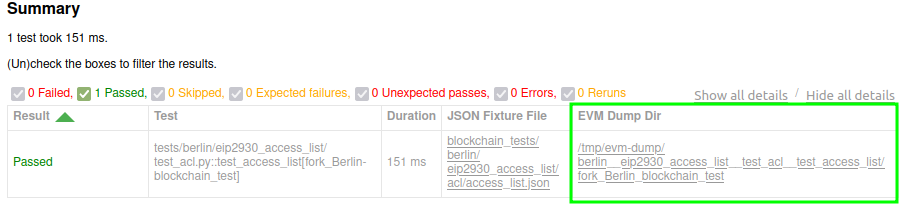

# Debugging Transition Tools

There are two flags that can help debugging `t8n` tools or the execution-spec-tests framework:

1. `--evm-dump-dir` (Default: <repo>/logs/evm): Write debug information from `t8n` tool calls to the specified directory.
2. `--traces`: Collect traces of the execution from the transition tool.
3. `--verify-fixtures`: Run go-ethereum's `evm blocktest` command to verify the generated test fixtures.

## EVM Dump Directory

The `--evm-dump-dir` flag tells the framework to write the inputs and outputs of every call made to the `t8n` command to the specified output directory. The aim is to help debugging or simply understand how a test is interacting with the EVM. The default location is `logs/evm` in the project root.

Each test case receives its own sub-directory under the `--evm-dump-dir` that contains these files which can be easily accessed from the HTML test report generated by `fill` (located by default in the root of the `--output` directory).

<figure markdown>
 {width=auto align=center}
</figure>

In particular, a script `t8n.sh` is generated for each call to the `t8n` command which can be used to reproduce the call to trigger errors or attach a debugger without the need to execute Python.

For example, running:

```console
fill tests/berlin/eip2930_access_list/ --fork Berlin -m blockchain_test \
    --evm-dump-dir=/tmp/evm-dump --traces
```

will produce the directory structure:

```text
📂 /tmp/evm-dump
└── 📂 berlin__eip2930_access_list__test_acl__test_access_list
    └── 📂 fork_Berlin_blockchain_test
        └── 📂 0
            ├── 📄 args.py
            ├── 📂 input
            │   ├── 📄 alloc.json
            │   ├── 📄 env.json
            │   └── 📄 txs.json
            ├── 📂 output
            │   ├── 📄 alloc.json
            │   ├── 📄 result.json
            │   └── 📄 txs.rlp
            ├── 📄 returncode.txt
            ├── 📄 stderr.txt
            ├── 📄 stdin.txt
            ├── 📄 stdout.txt
            ├── 📄 t8n.sh
            └── 📄 trace-0-0x5c4f07ce52f0a276a06aabdfff16cc693b5e007c018f9a42431e68200e2da515.jsonl
```

where the directory `0` is the starting index of the different calls made to the `t8n` tool executed during the test, and since the test only contains one block, there is only one directory present.

Note, there may be more directories present `1`, `2`, `3`,... if the test executes more blocks.

Each directory contains files containing information corresponding to the call, for example, the `args.py` file contains the arguments passed to the `t8n` command and the `output/alloc.json` file contains the output of the `t8n` command's `--output-alloc` flag.

### The `t8n.sh` Script

The `t8n.sh` script written to the debug directory can be used to reproduce a specific call made to the `t8n` command during the test session. For example, if a Besu `t8n-server` has been started on port `3001`, the request made by the test for first block can be reproduced as:

```console
/tmp/besu/test_access_list_fork_Berlin/0/t8n.sh 3001
```

which writes the response the from the `t8n-server` to the console output:

```json
{
  "alloc" : {
    "0x000000000000000000000000000000000000aaaa" : {
      "code" : "0x5854505854",
      "balance" : "0x4",
      "nonce" : "0x1"
    },
    "0x2adc25665018aa1fe0e6bc666dac8fc2697ff9ba" : {
      "balance" : "0x1bc16d674ecb26ce"
    },
    "0xa94f5374fce5edbc8e2a8697c15331677e6ebf0b" : {
      "balance" : "0x2cd931",
      "nonce" : "0x1"
    }
  },
  "body" : "0xf8a0b89e01f89b0180078304ef0094000000000000000000000000000000000000aaaa0180f838f7940000000000000000000000000000000000000000e1a0000000000000000000000000000000000000000000000000000000000000000001a02e16eb72206c93c471b5894800495ee9c64ae2d9823bcc4d6adeb5d9d9af0dd4a03be6691e933a0816c59d059a556c27c6753e6ce76d1e357b9201865c80b28df3",
  "result" : {
    "stateRoot" : "0x51799508f764047aee6606bc6a00863856f83ee5b91555f00c8a3cbdfbec5acb",
    ...
    ...
  }
}
```

The `t8n.sh` is written to the debug directory for all [supported t8n tools](./transition_tool_support.md).

## Verifying Test Fixtures via `evm blocktest`

The `--verify-fixtures` flag can be used to run go-ethereum's `evm blocktest` command in order to verify the generated JSON test fixtures.

For example, running:

```console
fill tests/berlin/eip2930_access_list/ --fork Berlin -m blockchain_test \
    --evm-dump-dir==/tmp/evm-dump \
    --evm-bin=../evmone/build/bin/evmone-t8n \
    --verify-fixtures-bin=../go-ethereum/build/bin/evm \
    --verify-fixtures
```

will additionally run the `evm blocktest` command on every JSON fixture file and write its output to the EVM dump directory:

```text
📂 /tmp/evm-dump
└── 📂 berlin__eip2930_access_list__test_acl__test_access_list
    ├── 📄 fixtures.json
    ├── 📂 fork_Berlin_blockchain_test
    │   ├── 📂 0
    │   │   ├── 📄 args.py
    │   │   ├── 📂 input
    │   │   │   ├── 📄 alloc.json
    │   │   │   ├── 📄 env.json
    │   │   │   └── 📄 txs.json
    │   │   ├── 📂 output
    │   │   │   ├── 📄 alloc.json
    │   ... ... ...
    │
    ├── 📄 verify_fixtures_args.py
    ├── 📄 verify_fixtures_returncode.txt
    ├── 📄 verify_fixtures.sh
    ├── 📄 verify_fixtures_stderr.txt
    └── 📄 verify_fixtures_stdout.txt
```

where the `verify_fixtures.sh` script can be used to reproduce the `evm blocktest` command.

### Further `--verify-fixtures` Examples

1. No fixture verification performed:

    ```console
    fill
    ```

2. Verify fixtures: Use the first `evm` binary in the `PATH` to execute both the `t8n` and `blocktest` commands (i.e., same binary used; this must be a geth binary):

    ```console
    fill --verify-fixtures
    ```

3. Explicitly specify the evm binary to execute the `blocktest` command (the first evm binary in the `PATH` is used for `t8n` commands; `--verify-fixtures` is not necessary):

    ```console
    fill --verify-fixtures-bin=../go-ethereum/build/bin/evm
    ```

4. Explicitly set two different `evm` binaries to execute the `t8n` and `blocktest` commands; write debug data to the specified `--evm-dump-dir`:

    ```console
    fill --evm-bin=../evmone/build/bin/evmone-t8n \
      --verify-fixtures-bin=../go-ethereum/build/bin/evm \
      --evm-dump-dir=/tmp/evm-dump
    ```

5. Additionally use `--single-fixture-per-file` to improve the granularity of the reporting of the `evm blocktest` command by writing the fixture generated by each parametrized test case to its own file.

    ```console
    fill --evm-bin=../evmone/build/bin/evmone-t8n \
      --verify-fixtures-bin=../go-ethereum/build/bin/evm \
      --evm-dump-dir=/tmp/evm-dump \
      --single-fixture-per-file
    ```

!!! note "Execution scope of `evm blocktest`"

    Note, by default, that `evm blocktest` is not executed per parametrized test case, but rather per test function. This is because each fixture JSON file contains fixtures for all the parametrized test cases for one test function. This means only one error will be reported, even if multiple fixtures fail within one fixture file.
    
    Additionally, it is only executed after all the test cases in the module have been executed[^1] and will only report the first failing test fixture in all files, even if there are multiple failing fixture files.
    
    This means, by default, that the feedback is not as granular as for test case execution. To improve granularity, and get feedback per parametrized test case use `--single-fixture-per-file`.

[^1]: <!-- markdownlint-disable MD053 (53=link-image-reference-definitions) -->
    This limitation is required to enable support of the [`pytest-xdist` plugin](https://github.com/pytest-dev/pytest-xdist) for concurrent test execution across multiple CPUs. To achieve this we use the we apply the `--dist loadscope` xdist flag in our `pytest.ini`.
