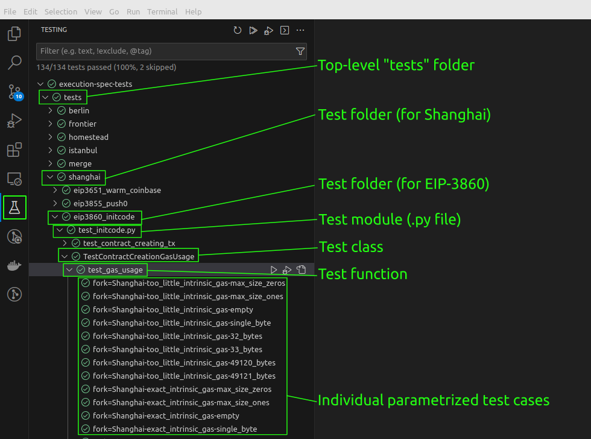
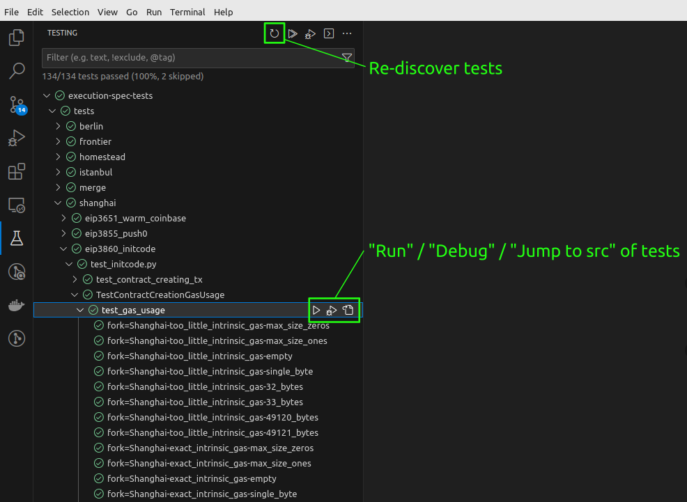

# Filling Tests in VS Code

Prerequisite: [VS Code Setup](../getting_started/setup_vs_code.md).

## Exploring Test Cases

Implemented test cases can be explored in VS Code's "Testing" View; click on the conical flask highlighted in the screenshot below.

<figure markdown>  <!-- markdownlint-disable MD033 (MD033=no-inline-html) -->
 { width=auto align=center}
</figure>

!!! note "Testing EVM Features Under Active Development"
     See [the VS Code section](./filling_tests_dev_fork.md#vs-code-setup) in [Filling Tests for Features under Development](./filling_tests_dev_fork.md) to explore tests targeting EVM features under development.

## Filling and Debugging Test Cases

<figure markdown>
 { width=auto align=center}
</figure>
