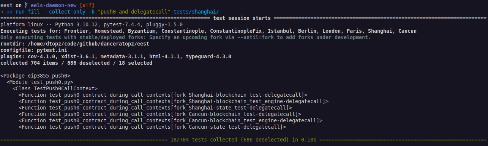

# Getting Started: Filling Tests

This guide describes how to get started with `fill` and commonly-used command-line options.

1. Explore test cases via `--collect-only` and search for test cases that combine `PUSH0` and `DELEGATECALL` in the EVM functionality introduced in the Shanghai hard fork:

    ```console
    uv run fill --collect-only -k "push0 and delegatecall" tests/shanghai/
    ```

    The `fill` command is based on [`pytest`](https://docs.pytest.org/en/stable/). The above command uses the [optional pytest arguments](https://docs.pytest.org/en/stable/how-to/usage.html):

    - `--collect-only` only collect test cases; don't execute them.
    - `-k <expression>` filter test cases by their test case ID based on the given expression.
    - `tests/shanghai` the directory containing the test cases (tells `fill` to only discover test cases in this directory; default: `tests/`).

    Expected console output:
    <figure markdown>  <!-- markdownlint-disable MD033 (MD033=no-inline-html) -->
        {align=center}
    </figure>

2. Fill `state_test` fixtures for these test cases:

    ```console
    uv run fill -k "push0 and delegatecall" tests/shanghai/ -m state_test -v
    ```

    where:

    - `-m state_test` only fills test cases marked as a `state_test` (see all available markers via `uv run fill --markers`).
    - `-v` enables verbose output.

    Expected console output:
    <figure markdown>  <!-- markdownlint-disable MD033 (MD033=no-inline-html) -->
        {align=center}
    </figure>

3. Verify the generated fixtures:

    a. Check the corresponding fixture file has been generated:

    ```console
    head fixtures/state_tests/shanghai/eip3855_push0/push0/push0_contract_during_call_contexts.json
    ```

    b. Open the generated HTML test using the link provided at the bottom of the console output. This is written to the output directory at:

    ```console
    ./fixtures/.meta/report_fill.html
    ```

## Next Steps

1. Learn [useful command-line flags](./filling_tests_command_line.md).
2. [Execute tests for features under development](./filling_tests_dev_fork.md) via the `--fork` flag.
3. _Optional:_ [Configure VS Code](../getting_started/setup_vs_code.md) to auto-format Python code and [execute tests within VS Code](./filling_tests_vs_code.md#filling-and-debugging-test-cases).
4. Implement a new test case, see [Writing Tests](../writing_tests/index.md).
