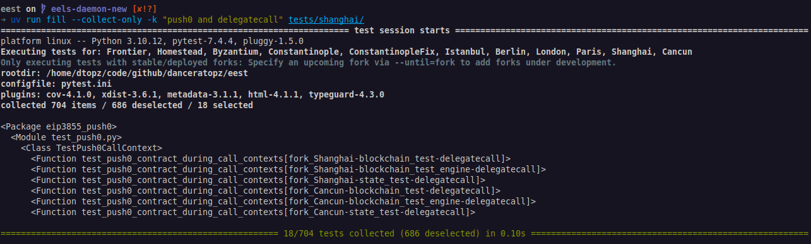

# Quick Start

!!! info "Testing features under active development"
    The EVM features under test must be implemented in the `evm` tool used by the execution-spec-tests framework. The following guide installs stable versions of these tools.

    To test features under active development, start with this base configuration and then follow the steps in [executing tests for features under development](./executing_tests_dev_fork.md). 

The following requires a Python 3.10, 3.11 or 3.12 installation.

1. Ensure `go-ethereum`'s `evm` tool is in your path. Either build the required versions, or alternatively:

    === "Ubuntu"

         - Install the geth evm using the [Ubuntu installation doc](https://geth.ethereum.org/docs/getting-started/installing-geth#ubuntu-via-ppas).

    === "macOS"

         - Install the geth evm using the [macOS installation doc](https://geth.ethereum.org/docs/getting-started/installing-geth#macos-via-homebrew).

    === "Windows"

          - Execution-spec-tests doesn't fully support the Windows OS natively, however Windows Subsystem for Linux (WSL) can be used as a stable alternative.
          - For those unfamiliar with WSL it's recommended to follow this [tutorial](https://learn.microsoft.com/en-us/windows/wsl/tutorials/wsl-vscode) to develop from the WSL environment alongside VS code.
          - Assuming Ubuntu is the Linux distribution within WSL please follow the geth [Ubuntu installation doc](https://geth.ethereum.org/docs/getting-started/installing-geth#ubuntu-via-ppas).

2. Clone the [execution-spec-tests](https://github.com/ethereum/execution-spec-tests) repo and install its dependencies and additional entry points. Note the virtual environment is a requirement, as the `solc` dependency is self-contained.

    ```console
    git clone https://github.com/ethereum/execution-spec-tests
    cd execution-spec-tests
    python src/entry_points/eest_utils.py init
    source venv/bin/activate
    ```

3. Verify the installation of the `fill` command:
    1. Explore test cases:

        ```console
        fill --collect-only
        ```

        Expected console output:
        <figure markdown>  <!-- markdownlint-disable MD033 (MD033=no-inline-html) -->
            {align=center}
        </figure>

    2. Execute the test cases (verbosely) in the `./tests/berlin/eip2930_access_list/test_acl.py` module:

        ```console
        fill -v tests/berlin/eip2930_access_list/test_acl.py
        ```

        Expected console output:
        <figure markdown>  <!-- markdownlint-disable MD033 (MD033=no-inline-html) -->
            {align=center}
        </figure>
        Check:

        1. The versions of the `evm` and `solc` tools are as expected (your versions may differ from those in the highlighted box).
        2. The corresponding fixture file has been generated:

            ```console
            head fixtures/blockchain_tests/berlin/eip2930_access_list/acl/access_list.json
            ```

## Useful Commands

After installing the execution-spec-tests (EEST) framework, our repo specific command line tool can be used for convenient utilities:

- `eest reset`: Performs a clean up of the repo, by removing all generated files and folders, then re-initializes and installs all required packages & dependencies (removes the virtual environment).
- `eest clean`: Cleans up and removes all generated folders and files (doesn't remove the virtual environment).
- `eest init`: Initializes the repo by installing all the relevant packages & dependencies (equivalent to running `python src/entry_points/eest_utils.py init` as before).

## Next Steps

1. Learn [useful fill command-line flags](./executing_tests_command_line.md).
2. [Execute tests for features under development](./executing_tests_dev_fork.md) via the `--fork` flag.
3. _Recommended:_ [Configure VS Code](./setup_vs_code.md) to auto-format Python code and [execute tests within VS Code](./executing_tests_vs_code.md#executing-and-debugging-test-cases).
4. Implement a new test case, see [Writing Tests](../writing_tests/index.md).
