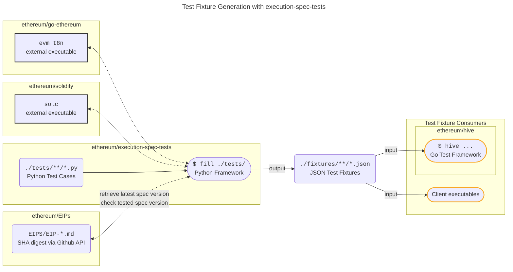

# Execution Spec Tests

<figure markdown>  <!-- markdownlint-disable MD033 (MD033=no-inline-html) -->
  {width="400"}
</figure>

@ethereum/execution-spec-tests is both a collection of test cases and a framework in Python to generate tests for Ethereum execution clients implemented.

The framework collects and executes the test cases in order to generate _test fixtures_ (JSON) which can be consumed by any execution client to verify their implementation of [ethereum/execution-specs](https://github.com/ethereum/execution-specs). The fixtures, which define state transition and block tests, are generated by the framework using one of the `t8n` command-line tools that are provided by most execution clients, see below for an overview of the supported `t8n` tools.

The generated test fixtures can be used:

1. Directly by client teams' test frameworks, and,
2. In the integration tests executed in the @ethereum/hive framework.

More information on how to use and download the [released test fixtures](https://github.com/ethereum/execution-spec-tests/releases) can be found [here](consuming_tests/index.md).

## Transition Tool Support

The following transition tools are supported by the framework:

| Client | `t8n` Tool | Tracing Support |
| -------| ---------- | --------------- |
| [ethereum/evmone](https://github.com/ethereum/evmone) | `evmone-t8n` | Yes |
| [ethereum/execution-specs](https://github.com/ethereum/execution-specs) | [`ethereum-spec-evm-resolver`](https://github.com/petertdavies/ethereum-spec-evm-resolver) | Yes |
| [ethereumjs](https://github.com/ethereumjs/ethereumjs-monorepo) | [`ethereumjs-t8ntool.sh`](https://github.com/ethereumjs/ethereumjs-monorepo/tree/master/packages/vm/test/t8n) | No |
| [ethereum/go-ethereum](https://github.com/ethereum/go-ethereum) | [`evm t8n`](https://github.com/ethereum/go-ethereum/tree/master/cmd/evm) | Yes |
| [hyperledger/besu](https://github.com/hyperledger/besu/tree/main/ethereum/evmtool) | [`evmtool t8n-server`](https://github.com/hyperledger/besu/tree/main/ethereum/evmtool) | Yes             |
| [status-im/nimbus-eth1](https://github.com/status-im/nimbus-eth1) | [`t8n`](https://github.com/status-im/nimbus-eth1/blob/master/tools/t8n/readme.md) | Yes |

## Relationship to ethereum/tests

This collection of tests is relatively new (test case development started Q4, 2022) and mainly targets recent and upcoming Ethereum specification changes. It does not replace, but rather complements the existing tests in [ethereum/tests](https://github.com/ethereum/tests).

## Motivation

The motivation to implement test cases in [ethereum/execution-spec-tests](https://github.com/ethereum/execution-spec-tests) is:

1. To implement test cases as code and ensure that changes, due to spec changes, for example, can be easily made. Moreover, changes are easily understandable and available in version control.
2. To avoid the 2-step approach often used in [ethereum/tests](https://github.com/ethereum/tests):
    1. Code (often unavailable) -> Test case (YAML).
    2. Test case (YAML) -> Fixtures (JSON).

!!! success "Contributing"
    Contributions via [PR](https://github.com/ethereum/execution-spec-tests/pulls) are welcome!
