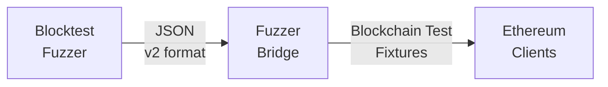

# Fuzzer Bridge

The fuzzer bridge provides a seamless integration between blocktest fuzzers and the Ethereum execution-spec-tests framework, enabling automatic generation of valid blockchain test fixtures from fuzzer output.

## Overview

Fuzzers are excellent at generating test inputs to discover edge cases and bugs in Ethereum client implementations. However, creating valid blockchain tests from fuzzer-generated data requires complex calculations including:

- State root computations
- RLP encoding of blocks and transactions
- Proper block header generation
- System contract interactions
- Genesis block derivation

The fuzzer bridge handles all these complexities automatically by leveraging the execution-spec-tests framework.

## Architecture



## Installation

The fuzzer bridge is included with the execution-spec-tests framework. Follow the [installation guide](../getting_started/installation.md) to set up EEST.

Once installed, the `fuzzer_bridge` command will be available through `uv run`.

## Fuzzer Output Format (v2)

The fuzzer must output JSON in the v2 format. Here's the structure:

```json
{
  "version": "2.0",
  "fork": "Prague",
  "chainId": 1,
  "accounts": {
    "0x7e5f4552091a69125d5dfcb7b8c2659029395bdf": {
      "balance": "0x1000000000000000000",
      "nonce": "0x0",
      "code": "",
      "storage": {},
      "privateKey": "0x0000000000000000000000000000000000000000000000000000000000000001"
    }
  },
  "transactions": [
    {
      "from": "0x7e5f4552091a69125d5dfcb7b8c2659029395bdf",
      "to": "0x2b5ad5c4795c026514f8317c7a215e218dccd6cf",
      "value": "0x100",
      "gas": "0x5208",
      "gasPrice": "0x7",
      "nonce": "0x0",
      "data": "0x"
    }
  ],
  "env": {
    "currentCoinbase": "0xc014ba5e00000000000000000000000000000000",
    "currentDifficulty": "0x0",
    "currentGasLimit": "0x1000000",
    "currentNumber": "0x1",
    "currentTimestamp": "0x1000",
    "currentBaseFee": "0x7",
    "currentRandom": "0x0000000000000000000000000000000000000000000000000000000000000000"
  }
}
```

### Key Requirements

1. **Private Keys**: Any account that sends transactions MUST include a `privateKey` field.
2. **Address-Key Match**: Private keys must generate the corresponding addresses.
3. **Environment**: Describes the environment for block 1 (genesis is automatically derived).
4. **Version**: Must be "2.0" for this format.
5. **Fork Name**: Use the standard fork name (e.g., "Prague", "Shanghai", "Cancun").

## Usage

### Command Line Interface

Convert fuzzer output to blockchain test fixtures:

```bash
# Basic conversion
uv run fuzzer_bridge --input fuzzer_output.json --output blocktest.json

# Specify a different fork
uv run fuzzer_bridge --input fuzzer_output.json --output blocktest.json --fork Shanghai

# Pretty print output
uv run fuzzer_bridge --input fuzzer_output.json --output blocktest.json --pretty

# Process multiple files in parallel
uv run fuzzer_bridge --input fuzzer_outputs/ --output fixtures/ --parallel

# Merge multiple outputs into a single fixture file
uv run fuzzer_bridge --input fuzzer_outputs/ --output fixtures/ --merge
```

### Python API

You can also use the fuzzer bridge programmatically in your Python code:

```python
from cli.fuzzer_bridge import FuzzerBridge
import json

# Load fuzzer output
with open("fuzzer_output.json") as f:
    fuzzer_data = json.load(f)

# Create bridge and convert
bridge = FuzzerBridge()
blocktest = bridge.convert(fuzzer_data)

# Save to file
bridge.save(blocktest, "output.json")

# Verify with a client
result = bridge.verify_with_geth(blocktest, geth_path="../go-ethereum/build/bin/evm")
print(f"Test passed: {result['pass']}")
```

### Integration with pytest

Generate tests dynamically from fuzzer output:

```python
import pytest
from cli.fuzzer_bridge import create_test_from_fuzzer

def test_fuzzer_generated(blockchain_test):
    """Test generated from fuzzer output."""
    test = create_test_from_fuzzer("fuzzer_output.json")
    blockchain_test(**test)
```

## How It Works

### Genesis Block Derivation

The fuzzer describes the environment for block 1 (the block containing the transactions). The genesis block (block 0) environment is automatically derived:

- `number` = 0
- `timestamp` = block1_timestamp - 12 (assuming 12-second block time)
- `baseFee` = calculated based on block 1's base fee
- Other values are inherited or set to defaults

### System Contracts

The framework automatically includes system contracts required by the fork:

- Deposit contract (for proof-of-stake)
- Withdrawal contract
- Beacon roots contract
- Other fork-specific contracts

These are included in the state root calculation without requiring fuzzer specification.

### Transaction Signing

All transactions are automatically signed using the provided private keys. The fuzzer bridge:

1. Validates that each sender has a corresponding private key
2. Signs transactions with the appropriate signature type for the fork
3. Handles EIP-1559 transactions when base fee is present
4. Properly encodes legacy and typed transactions

## Troubleshooting

### Common Issues

#### "Genesis block hash doesn't match"

- **Cause**: Environment parameters are incorrect
- **Solution**: Ensure the fuzzer output follows the v2 format exactly

#### "No private key for sender"

- **Cause**: Account sends transaction but no privateKey field provided
- **Solution**: Add privateKey to the account in the accounts section

#### "Private key doesn't match address"

- **Cause**: The provided private key doesn't generate the specified address
- **Solution**: Use correct private key or generate address from private key

#### "Transaction type not supported in fork"

- **Cause**: Using EIP-1559 transactions in pre-London forks
- **Solution**: Ensure transaction types match the specified fork

## Testing with Clients

Once you've generated blockchain test fixtures, verify them with Ethereum clients:

### Go-Ethereum (geth)

```bash
../go-ethereum/build/bin/evm blocktest generated_test.json
```

### Besu

```bash
../besu/ethereum/evmtool/build/install/evmtool/bin/evmtool block-test generated_test.json
```

### Nethermind

```bash
../nethermind/src/artifacts/bin/nethermind.test.runner test -b generated_test.json
```

## Advanced Features

### Batch Processing

Process multiple fuzzer outputs efficiently:

```python
from cli.fuzzer_bridge.cli import process_directory_parallel

# Process all JSON files in a directory
process_directory_parallel(
    input_dir="fuzzer_outputs/",
    output_dir="fixtures/",
    fork="Prague",
    workers=8
)
```

### Custom Fork Configuration

Override default fork parameters:

```python
from cli.fuzzer_bridge import BlocktestBuilder

builder = BlocktestBuilder(fork="Prague")
# Custom configuration
builder.env_overrides = {
    "currentRandom": "0x1234...",
    "currentExcessBlobGas": "0x0"
}
```

## Best Practices

1. **Validate Fuzzer Output**: Always validate that your fuzzer generates valid v2 format JSON
2. **Test with Multiple Clients**: Verify generated fixtures with multiple client implementations
3. **Use Parallel Processing**: For large batches, use `--parallel` flag for better performance
4. **Version Control**: Track generated fixtures in version control for regression testing
5. **Continuous Integration**: Integrate fuzzer bridge into CI pipelines for automated testing

## Further Resources

- [Blocktest Fuzzer Documentation](https://github.com/ethereum/blocktest-fuzzer)
- [EEST Framework Documentation](../index.md)
- [Ethereum Test Format Specifications](./reference_specification.md)
