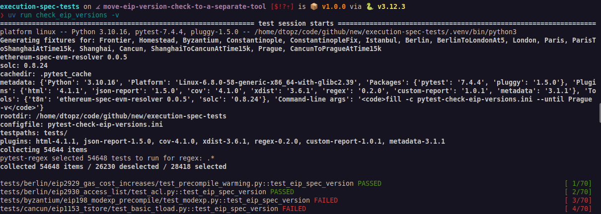
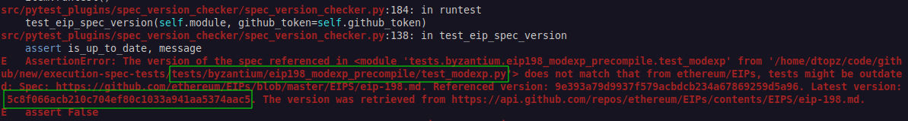

# Referencing an EIP Spec Version

Tests that implement features from an Ethereum Improvement Proposal ([ethereum/EIPs](https://github.com/ethereum/EIPs/tree/master/EIPS)) must define the EIP's markdown SHA digest within the test's Python module. This ensures our tests stay up-to-date with any changes to the EIP specifications.

The `check_eip_versions` command-line utility automatically verifies that all EIP references in the codebase are current. It works by comparing the SHA specified in the test against the latest version in the ethereum/EIPs repository. This utility uses pytest to generate test cases for every module that includes "eip" in its path.

<figure markdown>  <!-- markdownlint-disable MD033 (MD033=no-inline-html) -->
  { width=auto align=center}
</figure>

!!! note "The SHA digest value is provided in the failure message of the corresponding test"

    <figure markdown>  <!-- markdownlint-disable MD033 (MD033=no-inline-html) -->
      { width=auto align=center}
    </figure>

!!! info "Understanding and Retrieving the EIP Markdown's SHA Digest"

    The SHA value is the output from git's `hash-object` command, for example:

    ```console
    git clone git@github.com:ethereum/EIPs
    git hash-object EIPS/EIPS/eip-3651.md
    # output: d94c694c6f12291bb6626669c3e8587eef3adff1
    ```

    and can be retrieved from the remote repo via the Github API on the command-line as following:

    ```console
    sudo apt install jq
    curl -s -H "Accept: application/vnd.github.v3+json" \
    https://api.github.com/repos/ethereum/EIPs/contents/EIPS/eip-3651.md |\
    jq -r '.sha'
    # output: d94c694c6f12291bb6626669c3e8587eef3adff1
    ```

## How to Add a Spec Version Check

This check accomplished by adding the following two global variables anywhere in the Python source file:

| Variable Name             | Explanation                                                                                                                                                     |
| ------------------------- | --------------------------------------------------------------------------------------------------------------------------------------------------------------- |
| `REFERENCE_SPEC_GIT_PATH` | The relative path of the EIP markdown file in the [ethereum/EIPs](https://github.com/ethereum/EIPs/) repository, e.g. "`EIPS/eip-1234.md`"                      |
| `REFERENCE_SPEC_VERSION`  | The SHA hash of the latest version of the file retrieved from the Github API:<br/>`https://api.github.com/repos/ethereum/EIPs/contents/EIPS/eip-<EIP Number>.md` |

## Running the `check_eip_versions` Command Locally

A Github Personal Access Token (PAT) is required to avoid rate-limiting issues when using the Github API. The token can be specified via an environment variable or via the command-line. For example, the Github CLI can be used to obtain a token:

```bash
uv run check_eip_versions --github-token=$(gh auth token)
```

or a PAT can be created at: https://github.com/settings/personal-access-tokens/new.

By default, only tests up to and including the current fork under development will be checked. This is controlled by the `UNTIL_FORK` setting in the `src/config/check_eip_versions.py` configuration file. You can also pass a specific test path to limit the scope:

```shell
uv run check_eip_versions --github-token=$(gh auth token) tests/shanghai/eip3651_warm_coinbase/
```

This would only check EIP versions for the EIP-3651 tests in the `shanghai/eip3651_warm_coinbase` sub-directory.

## Automated Checks via GitHub Actions

The repository includes a [GitHub Actions workflow](https://github.com/ethereum/execution-spec-tests/actions/workflows/check_eip_versions.yaml) that automatically runs `check_eip_versions` on a daily schedule. If any outdated EIP references are detected, the workflow creates an issue in the repository with details about which references need to be updated.

This workflow uses GitHub's built-in token for authentication, so there's no need to configure personal access tokens for the automated checks. The issue will include links to the relevant workflow run and details about which tests need updating.

## Example

Here is an example from [./tests/shanghai/eip3651_warm_coinbase/test_warm_coinbase.py](../tests/shanghai/eip3651_warm_coinbase/test_warm_coinbase/index.md):

```python
REFERENCE_SPEC_GIT_PATH = "EIPS/eip-3651.md"
REFERENCE_SPEC_VERSION = "d94c694c6f12291bb6626669c3e8587eef3adff1"
```

The SHA digest was retrieved [from here](https://api.github.com/repos/ethereum/EIPs/contents/EIPS/eip-3651.md).
