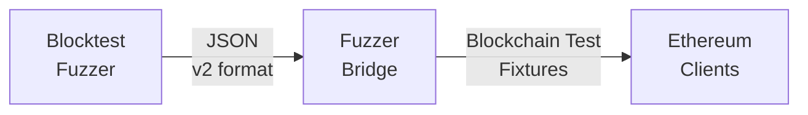
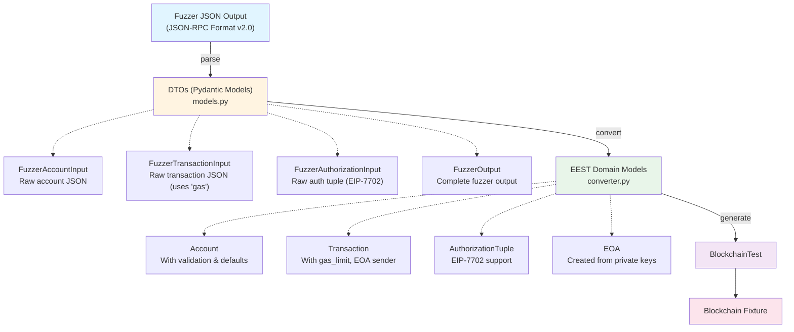

# Fuzzer Bridge for Execution Spec Tests

This module provides a bridge between blocktest fuzzers (like `blocktest-fuzzer`) and the Ethereum execution-spec-tests framework, enabling automatic generation of valid blockchain test fixtures from fuzzer output.

## Overview

The fuzzer bridge solves a critical problem: fuzzers can generate transactions and pre-state, but creating valid blockchain tests requires complex calculations (state roots, RLP encoding, block headers, etc.). This bridge leverages the execution-spec-tests framework to handle all these complexities.

## Architecture



## Fuzzer Output Format (v2)

The fuzzer must output JSON in the following format:

```json
{
  "version": "2.0",
  "fork": "Prague",
  "chainId": 1,
  "accounts": {
    "0x7e5f4552091a69125d5dfcb7b8c2659029395bdf": {
      "balance": "0x1000000000000000000",
      "nonce": "0x0",
      "code": "",
      "storage": {},
      "privateKey": "0x0000000000000000000000000000000000000000000000000000000000000001"
    },
    "0x2b5ad5c4795c026514f8317c7a215e218dccd6cf": {
      "balance": "0x100000000000000000",
      "nonce": "0x0",
      "code": "0x600160005260206000f3",
      "storage": {}
    }
  },
  "transactions": [
    {
      "from": "0x7e5f4552091a69125d5dfcb7b8c2659029395bdf",
      "to": "0x2b5ad5c4795c026514f8317c7a215e218dccd6cf",
      "value": "0x100",
      "gas": "0x5208",
      "gasPrice": "0x7",
      "nonce": "0x0",
      "data": "0x"
    }
  ],
  "env": {
    "currentCoinbase": "0xc014ba5e00000000000000000000000000000000",
    "currentDifficulty": "0x0",
    "currentGasLimit": "0x1000000",
    "currentNumber": "0x1",
    "currentTimestamp": "0x1000",
    "currentBaseFee": "0x7",
    "currentRandom": "0x0000000000000000000000000000000000000000000000000000000000000000"
  }
}
```

### Key Requirements

1. **Private Keys**: Any account that sends transactions MUST include a `privateKey` field.
2. **Address-Key Match**: Private keys must generate the corresponding addresses.
3. **Environment**: Describes the environment for block 1 (genesis is automatically derived).
4. **Version**: Use "2.0" for this format.

## Architecture: DTO Pattern

The fuzzer bridge uses a **Data Transfer Object (DTO) pattern** for clean separation between external data format and internal domain logic.

### Design Flow



### Why DTOs?

1. **Separation of Concerns**
   - External JSON-RPC format ≠ EEST internal representation
   - Fuzzer format can change without affecting EEST domain models

2. **No Side Effects During Parsing**
   - DTOs don't trigger `model_post_init` validation logic
   - Parsing is purely data extraction, no business logic

3. **Explicit Field Mapping**
   - Clear visibility: `gas` → `gas_limit`, `from` → `sender` (EOA)
   - Type-safe conversions at boundary

4. **Prevents TestAddress Pollution**
   - EOA created in converter BEFORE Transaction instantiation
   - Transaction.model_post_init never injects TestAddress

### Key Field Mappings

| Fuzzer Field (JSON-RPC) | DTO Field            | EEST Domain Field    | Notes                          |
|-------------------------|----------------------|----------------------|--------------------------------|
| `from`                  | `from_`              | `sender` (EOA)       | Creates EOA from private key   |
| `gas`                   | `gas`                | `gas_limit`          | JSON-RPC vs internal naming    |
| `data`                  | `data`               | `data`               | Same field, explicit mapping   |
| `gasPrice`              | `gas_price`          | `gas_price`          | CamelCase → snake_case         |
| `authorizationList`     | `authorization_list` | `authorization_list` | EIP-7702 support               |
| `privateKey`            | `private_key`        | (used to create EOA) | Not stored in Account model    |

### Module Responsibilities

#### `models.py` - Data Transfer Objects
- Pure Pydantic models for fuzzer JSON format
- No business logic, only data validation
- Accepts JSON-RPC naming conventions (camelCase)
- ~119 lines

#### `converter.py` - Transformation Logic
- Pure functions: DTO → EEST domain models
- All field mapping logic centralized here
- Creates EOA objects from private keys
- Builds BlockchainTest from validated data
- ~305 lines

#### `blocktest_builder.py` - CLI Integration
- Orchestrates conversion workflow
- Handles file I/O and CLI options
- Calls converter functions
- ~90 lines

### Benefits

✅ **Maintainability**: Changes to Account/Transaction propagate automatically
✅ **Testability**: Each layer tested independently
✅ **Type Safety**: Full type checking at DTO and domain layers
✅ **Clarity**: Field mappings are explicit and documented
✅ **No Circular Dependencies**: Clean module boundaries

### Alternative Design: Why Not Inheritance?

**Could have done**:
```python
class FuzzerAccount(Account):
    private_key: Hash | None = None
```

**Why DTOs are better**:
- Inheritance couples external format to domain model
- model_post_init triggers during parsing (side effects)
- Field name mismatches require complex aliasing
- Harder to test layers independently

The DTO pattern provides cleaner separation and explicit control.

## Installation

See the [EEST installation guide](https://eest.ethereum.org/main/getting_started/installation/) for setting up the execution-spec-tests framework.

Once EEST is installed, the fuzzer bridge will be available as a command-line tool.

## Usage

### 1. Command Line Interface

```bash
# Convert fuzzer output to blockchain test
uv run fuzzer_bridge --input fuzzer_output.json --output blocktest.json

# With custom fork
uv run fuzzer_bridge --input fuzzer_output.json --output blocktest.json --fork Shanghai

# Pretty print output
uv run fuzzer_bridge --input fuzzer_output.json --output blocktest.json --pretty
```

### 2. Python API

```python
from fuzzer_bridge import FuzzerBridge

# Load fuzzer output
with open("fuzzer_output.json") as f:
    fuzzer_data = json.load(f)

# Create bridge and convert
bridge = FuzzerBridge()
blocktest = bridge.convert(fuzzer_data)

# Save to file
bridge.save(blocktest, "output.json")

# Or verify with geth directly
result = bridge.verify_with_geth(blocktest, geth_path="../go-ethereum/build/bin/evm")
print(f"Test passed: {result['pass']}")
```

### 3. Integration with pytest

```python
import pytest
from fuzzer_bridge import create_test_from_fuzzer

def test_fuzzer_generated(blockchain_test):
    """Test generated from fuzzer output."""
    test = create_test_from_fuzzer("fuzzer_output.json")
    blockchain_test(**test)
```

## Key Insights

### Genesis Block Handling
- The fuzzer describes the environment for block 1 (the block being tested)
- Genesis (block 0) environment is automatically derived:
  - `number` = 0
  - `timestamp` = block1_timestamp - 12
  - Other values inherited or set to defaults

### System Contracts
- The framework automatically adds system contracts (deposit, withdrawal, etc.)
- These are included in the state root calculation
- The fuzzer doesn't need to specify them

### Private Key Requirements
- Every account that sends transactions needs a private key
- The private key must generate the exact address specified
- Without matching private keys, transactions cannot be signed

## Troubleshooting

### "Genesis block hash doesn't match"
**Cause**: Usually means the environment is set incorrectly (e.g., block number = 1 instead of 0 for genesis)
**Solution**: Ensure the fuzzer output follows the v2 format exactly

### "No private key for sender"
**Cause**: Account sends transaction but no privateKey field provided
**Solution**: Add privateKey to the account in the accounts section

### "Private key doesn't match address"
**Cause**: The provided private key doesn't generate the specified address
**Solution**: Use correct private key or generate address from private key

## Testing with Ethereum Clients

### Go-Ethereum (geth)
```bash
../go-ethereum/build/bin/evm blocktest generated_test.json
```

### Besu
```bash
../besu/ethereum/evmtool/build/install/evmtool/bin/evmtool block-test generated_test.json
```

### Nethermind
```bash
../nethermind/src/Nethermind/artifacts/bin/Nethermind.Test.Runner/release_linux-x64/nethtest -b -i generated_test.json
```

## Contributing

When modifying the fuzzer bridge:
1. Add tests for new features.
2. Update this README.
3. Ensure compatibility with latest execution-spec-tests.